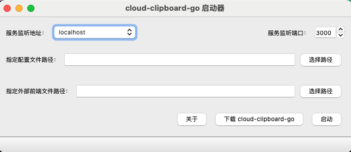

# cloud-clipboard-go 启动器
> 为 [cloud-clipboard-go](https://github.com/Jonnyan404/cloud-clipboard-go) 制作的启动器，方便不想或不会使用终端的用户

> 基于 https://github.com/songquanpeng/gofile-launcher 项目修改而来

<p>
  <a href="https://raw.githubusercontent.com/jonnyan404/cloud-clipboard-go-launcher/main/LICENSE">
    
  </a>
  <a href="https://github.com/jonnyan404/cloud-clipboard-go-launcher/releases/latest">
    
  </a>
  <a href="https://github.com/jonnyan404/cloud-clipboard-go-launcher/releases/latest">
    
  </a>
</p>

可在 [Release 页面](https://github.com/Jonnyan404/cloud-clipboard-go-launcher/releases/latest)下载最新版本（Windows，macOS，Linux）。

## 功能
1. 一键启动 cloud-clipboard-go。
2. 配置自动保存。
3. 自动下载 & 一键更新 cloud-clipboard-go。
4. 关闭时自动关闭打开的 cloud-clipboard-go，用完即走。

## 截图展示


## 使用方法
### Windows 用户
1. 从 [Release 页面](https://github.com/Jonnyan404/cloud-clipboard-go-launcher/releases/latest) 下载 `cloud-clipboard-go-launcher-*.exe`（x86_64 版选择 `cloud-clipboard-go-launcher-x86_64.exe`，arm64 版选择 `cloud-clipboard-go-launcher-arm64.exe`）
2. 将下载的启动器放入一个目录，双击运行。
3. 首次运行时，启动器会自动下载核心程序 `cloud-clipboard-go`。

### macOS 用户
- 方式一
1. 下载`*.dmg`或者`*-macos.zip`之后安装并运行；
2. 授权应用:
```
在`系统设置`-->`隐私与安全性`-->`安全性`处,允许运行即可。
或者
xattr -cr /Applications/cloud-clipboard-go.app
```

- 方式二

```bash
# 添加我们的 tap
brew tap jonnyan404/tap
# 安装应用
brew install --cask cloud-clipboard-go

# 更新
brew update
brew upgrade --cask cloud-clipboard-go
```

### 手动安装

从 [Releases 页面](https://github.com/jonnyan404/cloud-clipboard-go-launcher/releases/latest) 下载最新的 `.dmg` 文件，然后拖放到应用程序文件夹。

### Linux 用户
1. 从 [Release 页面](https://github.com/Jonnyan404/cloud-clipboard-go-launcher/releases/latest) 下载对应的 `cloud-clipboard-go-*-Linux-<架构>.tar.gz`（x86_64 / arm64）。
2. 解压后得到启动器二进制 `cloud-clipboard-go-launcher`，放入一个目录：
   ```bash
   tar -xzf cloud-clipboard-go-*-Linux-x86_64.tar.gz
   chmod +x cloud-clipboard-go-launcher
   ./cloud-clipboard-go-launcher
   ```
3. 首次运行时，启动器会自动下载核心程序 `cloud-clipboard-go`。

## 打包流程
> 启动器二进制统一命名为 `cloud-clipboard-go-launcher`；下载的核心程序则为 `cloud-clipboard-go`，两者不会互相覆盖。

### Linux / Windows
```bash
pip install -r requirements.txt
pyside6-uic main.ui -o ui.py
pyside6-rcc resource.qrc -o resource_rc.py
pyinstaller --noconsole -F ./main.py --icon icon.png -n cloud-clipboard-go-launcher
```

### macOS
```bash
pip install -r requirements.txt
pyside6-uic main.ui -o ui.py
pyside6-rcc resource.qrc -o resource_rc.py
pyinstaller --windowed --noconfirm --clean --icon icon.png --name cloud-clipboard-go-launcher main.py
```
macOS 的发布 DMG（`cloud-clipboard-go-<版本>-macOS-universal.dmg`）内为 `cloud-clipboard-go.app`，用 create-dmg 及 lipo 合并 universal2 生成。

# 致谢

- https://github.com/songquanpeng/gofile-launcher