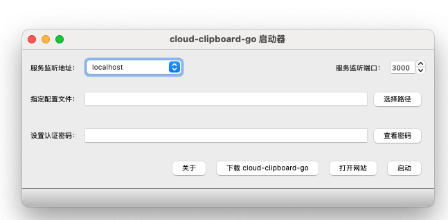

# cloud-clipboard-go 启动器
> 为 [cloud-clipboard-go](https://github.com/Jonnyan404/cloud-clipboard-go) 制作的启动器，方便不想或不会使用终端的用户
> 基于 https://github.com/songquanpeng/gofile-launcher 项目修改而来

<p>
  <a href="https://raw.githubusercontent.com/jonnyan404/cloud-clipboard-go-launcher/main/LICENSE">
    
  </a>
  <a href="https://github.com/jonnyan404/cloud-clipboard-go-launcher/releases/latest">
    
  </a>
  <a href="https://github.com/jonnyan404/cloud-clipboard-go-launcher/releases/latest">
    
  </a>
</p>

可在 [Release 页面](https://github.com/jonnyan404/cloud-clipboard-go-lancher/releases/latest)下载最新版本（Windows，macOS，Linux）。

## 功能
1. 一键启动 cloud-clipboard-go。
2. 配置自动保存。
3. 自动下载 & 一键更新 cloud-clipboard-go。
4. 关闭时自动关闭打开的 cloud-clipboard-go，用完即走。

## 截图展示


## 使用方法
### Windows 用户  
直接双击 cloud-clipboard-go-launcher.exe 运行。

### macOS 用户
1. 给执行权限：`chmod u+x cloud-clipboard-go-launcher-macos`；
2. 之后直接双击运行 cloud-clipboard-go-launcher-macos 或在终端中运行都可。

### Linux 用户
同上，区别在于文件名换成 `cloud-clipboard-go-launcher`。

## 打包流程
```bash
pip install -r requirements.txt
pyuic5 -o ui.py main.ui
pyrcc5 -o resource_rc.py resource.qrc 
pyinstaller --noconsole -F ./main.py --icon icon.png -n cloud-clipboard-go-launcher.exe
```

# 致谢

- https://github.com/songquanpeng/gofile-launcher